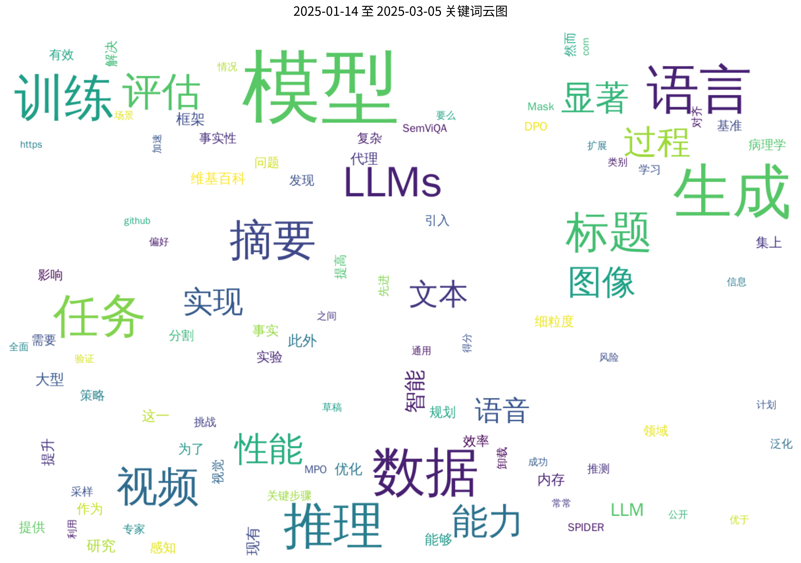

#  Hugging Face 2025-03-04 论文日报

## 📊 今日论文统计
- 总论文数：25
- 热门领域：Vision, MultiModal, LLM, Transformer, RL, GPT

## 📝 论文详情

### 1. Visual-RFT：视觉强化微调

**原文标题：** Visual-RFT: Visual Reinforcement Fine-Tuning

**摘要：**
在大型推理模型（如OpenAI o1）中，强化微调（Reinforcement Fine-Tuning, RFT）通过对其答案的反馈进行学习，这在微调数据稀缺的应用中尤为有用。最近的开源工作（如DeepSeek-R1）表明，具有可验证奖励的强化学习是复现o1的关键方向之一。尽管R1风格的模型在语言模型中已取得成功，但其在多模态领域的应用仍未被充分探索。本文提出了视觉强化微调（Visual-RFT），进一步扩展了RFT在视觉任务中的应用领域。具体而言，Visual-RFT首先使用大型视觉语言模型（Large Vision-Language Models, LVLMs）为每个输入生成包含推理标记和最终答案的多个响应，然后使用我们提出的视觉感知可验证奖励函数，通过策略优化算法（如组相对策略优化，Group Relative Policy Optimization, GRPO）更新模型。我们为不同的感知任务设计了不同的可验证奖励函数，例如用于目标检测的交并比（Intersection over Union, IoU）奖励。在细粒度图像分类、少样本目标检测、推理定位以及开放词汇目标检测基准上的实验结果表明，与监督微调（Supervised Fine-tuning, SFT）相比，Visual-RFT具有竞争性的性能和更强的泛化能力。例如，在仅有约100个样本的单样本细粒度图像分类任务中，Visual-RFT将准确率比基线提高了24.3%。在少样本目标检测任务中，Visual-RFT在COCO的双样本设置上比基线高出21.9，在LVIS上高出15.4。我们的Visual-RFT代表了微调LVLMs的范式转变，提供了一种数据高效、奖励驱动的方法，增强了领域特定任务的推理能力和适应性。

**论文链接：** [HuggingFace](https://huggingface.co/papers/2503.01785) | [arXiv](https://arxiv.org/abs/2503.01785)

---

### 2. Difix3D+：通过单步扩散模型改进三维重建

**原文标题：** Difix3D+: Improving 3D Reconstructions with Single-Step Diffusion Models

**摘要：**
神经辐射场（Neural Radiance Fields）和三维高斯溅射（3D Gaussian Splatting）技术已经彻底改变了三维重建和新视角合成任务。然而，从极端新视角实现逼真渲染仍然具有挑战性，因为伪影在各种表示中持续存在。在本研究中，我们提出了Difix3D+，一种旨在通过单步扩散模型增强三维重建和新视角合成的新颖流程。我们方法的核心是Difix，这是一种单步图像扩散模型，经过训练以增强和消除由三维表示中未充分约束区域引起的渲染新视角中的伪影。Difix在我们的流程中扮演两个关键角色。首先，它在重建阶段用于清理从重建中渲染的伪训练视图，然后将其蒸馏回三维。这极大地增强了未充分约束的区域，并提高了整体三维表示的质量。更重要的是，Difix还在推理过程中充当神经增强器，有效消除由于不完善的三维监督和当前重建模型能力有限而产生的残余伪影。Difix3D+是一种通用解决方案，一个与NeRF和3DGS表示兼容的单一模型，它在保持三维一致性的同时，将FID评分平均提高了2倍于基线水平。

**论文链接：** [HuggingFace](https://huggingface.co/papers/2503.01774) | [arXiv](https://arxiv.org/abs/2503.01774)

---

### 3. Phi-4-Mini技术报告：通过混合LoRAs实现紧凑而强大的多模态语言模型

**原文标题：** Phi-4-Mini Technical Report: Compact yet Powerful Multimodal Language
  Models via Mixture-of-LoRAs

**摘要：**
我们介绍了Phi-4-Mini和Phi-4-Multimodal，这是两款紧凑但能力极强的语言和多模态模型。Phi-4-Mini是一个拥有38亿参数的语言模型，基于高质量的网络和合成数据进行训练，在需要复杂推理的数学和编程任务上，显著优于近期开源的类似规模模型，并匹敌规模是其两倍的模型。这一成就得益于精心设计的合成数据配方，特别强调高质量的数学和编程数据集。与上一代Phi-3.5-Mini相比，Phi-4-Mini的词汇量扩展至20万个标记，以更好地支持多语言应用，并采用组查询注意力机制以提高长序列生成的效率。Phi-4-Multimodal是一款多模态模型，将文本、视觉和语音/音频输入模式集成于单一模型中。其新颖的模式扩展方法利用LoRA适配器和特定模式的路由器，允许多种模式组合的推理模式互不干扰。例如，尽管语音/音频模式的LoRA组件仅有4.6亿参数，它已在OpenASR排行榜上位居首位。Phi-4-Multimodal支持涉及（视觉+语言）、（视觉+语音）和（语音/音频）输入的场景，在多种任务上超越更大的视觉-语言和语音-语言模型。此外，我们通过实验进一步训练Phi-4-Mini以增强其推理能力。尽管其紧凑的38亿参数规模，这一实验版本在推理性能上达到或超越了包括DeepSeek-R1-Distill-Qwen-7B和DeepSeek-R1-Distill-Llama-8B在内的显著更大的模型。

**论文链接：** [HuggingFace](https://huggingface.co/papers/2503.01743) | [arXiv](https://arxiv.org/abs/2503.01743)

---

### 4. OneRec：基于生成式推荐和迭代偏好对齐的统一检索与排序模型

**原文标题：** OneRec: Unifying Retrieve and Rank with Generative Recommender and
  Iterative Preference Alignment

**摘要：**
近年来，基于生成式检索的推荐系统已成为一种有前景的范式。然而，大多数现代推荐系统采用检索-排序策略，其中生成模型仅在检索阶段作为选择器使用。本文提出了OneRec，它用一个统一的生成模型取代了级联学习框架。据我们所知，这是第一个在现实场景中显著超越当前复杂且精心设计的推荐系统的端到端生成模型。具体而言，OneRec包括：1）一个编码器-解码器结构，该结构编码用户的历史行为序列，并逐步解码用户可能感兴趣的视频。我们采用稀疏专家混合（MoE）来扩展模型容量，而不会按比例增加计算量。2）一种会话式生成方法。与传统的下一项预测不同，我们提出了一种会话式生成方法，它比依赖手工规则来正确组合生成结果的逐点生成方法更为优雅且上下文连贯。3）一个结合直接偏好优化（DPO）的迭代偏好对齐模块，以提高生成结果的质量。与自然语言处理中的DPO不同，推荐系统通常只有一次机会为每个用户的浏览请求显示结果，因此无法同时获得正负样本。为了解决这一限制，我们设计了一个奖励模型来模拟用户生成并定制采样策略。大量实验表明，有限数量的DPO样本可以对齐用户兴趣偏好，并显著提高生成结果的质量。我们在快手的主场景中部署了OneRec，实现了1.6%的观看时间增长，这是一个显著的改进。

**论文链接：** [HuggingFace](https://huggingface.co/papers/2502.18965) | [arXiv](https://arxiv.org/abs/2502.18965)

---

### 5. 当大型语言模型对其答案感到担忧时——以及其不确定性何时是合理的

**原文标题：** When an LLM is apprehensive about its answers -- and when its
  uncertainty is justified

**摘要：**
不确定性估计对于评估大型语言模型（LLMs）至关重要，特别是在高风险领域，错误的答案会导致严重后果。许多方法在考虑这一问题时，专注于特定类型的不确定性，而忽略了其他类型。我们研究了哪些估计方法，特别是基于词元的熵和模型作为评判者（MASJ），适用于不同主题的多项选择题回答任务。我们的实验考虑了三种不同规模的LLMs：Phi-4、Mistral和Qwen，规模从1.5B到72B，涵盖了14个主题。虽然MASJ的表现类似于随机错误预测器，但响应熵在知识依赖领域中预测模型错误，并作为问题难度的有效指标：对于生物学，ROC AUC为0.73。这种相关性在推理依赖领域中消失：对于数学问题，ROC-AUC为0.55。更根本的是，我们发现熵测量需要一定的推理量。因此，与数据不确定性相关的熵应整合到不确定性估计框架中，而MASJ则需要改进。此外，现有的MMLU-Pro样本存在偏差，应平衡不同子领域所需的推理量，以提供更公平的LLMs性能评估。

**论文链接：** [HuggingFace](https://huggingface.co/papers/2503.01688) | [arXiv](https://arxiv.org/abs/2503.01688)

---

### 6. DiffRhythm：基于潜在扩散的极速且极简端到端全长歌曲生成方法

**原文标题：** DiffRhythm: Blazingly Fast and Embarrassingly Simple End-to-End
  Full-Length Song Generation with Latent Diffusion

**摘要：**
近年来，音乐生成领域取得了显著进展，然而现有方法仍面临一些关键限制。当前的一些生成模型只能合成人声轨道或伴奏轨道。虽然有些模型能够生成包含人声和伴奏的完整音乐，但它们通常依赖于精心设计的多阶段级联架构和复杂的数据处理流程，这限制了其可扩展性。此外，大多数系统仅限于生成短音乐片段而非全长歌曲。同时，广泛使用的基于语言模型的方法存在推理速度慢的问题。为解决这些挑战，我们提出了DiffRhythm，这是首个基于潜在扩散的歌曲生成模型，能够在仅十秒内合成包含人声和伴奏的完整歌曲，时长可达4分45秒，同时保持较高的音乐性和可理解性。尽管DiffRhythm具有卓越的性能，但其设计简洁优雅：它无需复杂的数据准备，采用简单的模型结构，在推理过程中仅需歌词和风格提示。此外，其非自回归结构确保了快速的推理速度。这种简洁性保证了DiffRhythm的可扩展性。我们还发布了完整的训练代码以及在大规模数据上预训练的模型，以促进研究的可重复性和进一步探索。

**论文链接：** [HuggingFace](https://huggingface.co/papers/2503.01183) | [arXiv](https://arxiv.org/abs/2503.01183)

---

### 7. Liger：将大型语言模型线性化为门控循环结构

**原文标题：** Liger: Linearizing Large Language Models to Gated Recurrent Structures

**摘要：**
具有线性循环建模的Transformer提供了线性时间训练和恒定内存推理。尽管它们展示了效率和性能，但从头开始预训练这种非标准架构仍然成本高昂且风险较大。大型语言模型（LLM）的线性化将预训练的标准模型转化为线性循环结构，从而实现更高效的部署。然而，当前的线性化方法通常引入额外的特征映射模块，这些模块需要大量的微调，并且忽略了最先进的线性循环模型中使用的门控机制。为了解决这些问题，本文提出了Liger，即“将LLM线性化为门控循环结构”的简称。Liger是一种将预训练的LLM转换为门控线性循环模型的新方法，无需添加额外参数。它重新利用预训练的键矩阵权重来构建多样化的门控机制，促进各种门控循环结构的形成，同时避免了从头训练额外组件的需求。通过使用低秩适应（LoRA）进行轻量级微调，Liger恢复了线性化门控循环模型的性能，使其与原始LLM相匹配。此外，我们引入了Liger Attention，一种层内混合注意力机制，在仅使用0.02%的预训练令牌的情况下，显著恢复了基于Transformer的LLM的93%性能，在多个基准测试中取得了具有竞争力的结果，这在1B到8B参数的模型上得到了验证。代码可在https://github.com/OpenSparseLLMs/Linearization获取。

**论文链接：** [HuggingFace](https://huggingface.co/papers/2503.01496) | [arXiv](https://arxiv.org/abs/2503.01496)

---

### 8. Qilin：一个包含APP级用户会话的多模态信息检索数据集

**原文标题：** Qilin: A Multimodal Information Retrieval Dataset with APP-level User
  Sessions

**摘要：**
用户生成内容（UGC）社区，尤其是那些以多模态内容为特色的社区，通过将视觉和文本信息整合到结果（或项目）中来提升用户体验。近年来，在复杂系统中提升搜索和推荐（S&R）服务的用户体验的挑战引起了学术界和工业界的广泛关注。然而，高质量数据集的缺乏限制了对多模态S&R的研究进展。为了满足开发更好S&R服务的日益增长的需求，本文提出了一个新颖的多模态信息检索数据集，即Qilin。该数据集收集自小红书，这是一个拥有超过3亿月活跃用户且平均搜索渗透率超过70%的流行社交平台。与现有数据集相比，Qilin提供了全面的用户会话集合，包含图像-文本笔记、视频笔记、商业笔记和直接答案等异构结果，促进了跨多种任务设置的高级多模态神经检索模型的开发。为了更好地建模用户满意度并支持异构用户行为的分析，我们还收集了广泛的APP级上下文信号和真实的用户反馈。值得注意的是，Qilin包含了用户偏好的答案及其在触发深度查询回答（DQA）模块的搜索请求中引用的结果。这不仅允许训练和评估检索增强生成（RAG）管道，还允许探索此类模块如何影响用户的搜索行为。通过全面的分析和实验，我们为进一步改进S&R系统提供了有趣的发现和见解。我们希望Qilin将显著推动未来具有S&R服务的多模态内容平台的发展。

**论文链接：** [HuggingFace](https://huggingface.co/papers/2503.00501) | [arXiv](https://arxiv.org/abs/2503.00501)

---

### 9. 实现自我改进推理者的认知行为，或高效STaRs的四大习惯

**原文标题：** Cognitive Behaviors that Enable Self-Improving Reasoners, or, Four
  Habits of Highly Effective STaRs

**摘要：**
测试时推理已成为一种强大的范式，使语言模型能够像熟练的人类专家一样，对复杂挑战进行更长时间和更深入的“思考”。虽然强化学习（RL）可以在可验证任务中推动语言模型的自我改进，但一些模型表现出显著的提升，而其他模型则迅速达到瓶颈。例如，我们发现，在相同的RL训练下，Qwen-2.5-3B在Countdown游戏中的表现远远超过Llama-3.2-3B。这种差异引发了一个关键问题：哪些内在属性能够实现有效的自我改进？我们引入了一个框架，通过分析四种关键认知行为——验证、回溯、子目标设定和反向链——来研究这个问题，这些行为既是人类专家问题解决者也是成功的语言模型所采用的。我们的研究表明，Qwen自然表现出这些推理行为，而Llama最初缺乏这些行为。在控制行为数据集的系统实验中，我们发现，通过在RL训练前为Llama提供包含这些推理行为的示例，可以显著提升其表现，达到或超过Qwen的表现。重要的是，推理行为的存在，而非答案的正确性，被证明是关键因素——使用包含正确推理模式的错误解决方案进行训练的模型，其表现与使用正确解决方案训练的模型相当。最后，利用OpenWebMath数据进行持续预训练，并通过过滤增强推理行为，使Llama模型能够匹配Qwen的自我改进轨迹。我们的研究结果确立了初始推理行为与改进能力之间的基本关系，解释了为什么一些语言模型能够有效利用额外的计算资源，而其他模型则停滞不前。

**论文链接：** [HuggingFace](https://huggingface.co/papers/2503.01307) | [arXiv](https://arxiv.org/abs/2503.01307)

---

### 10. 推测性即时查询

**原文标题：** Speculative Ad-hoc Querying

**摘要：**
分析大型数据集需要响应迅速的查询执行，但在海量数据集上执行SQL查询可能会很慢。本文探讨了是否可以在用户完成输入之前就开始查询执行，从而使结果几乎即时显示。我们提出了SpeQL系统，该系统利用大型语言模型（LLMs）根据数据库模式、用户过去的查询及其不完整的查询来预测可能的查询。由于精确的查询预测是不可行的，SpeQL通过两种方式对部分查询进行推测：1）预测查询结构以提前编译和计划查询，2）预计算比原始数据库小得多的临时表，但仍预测包含回答用户最终查询所需的所有信息。此外，SpeQL实时连续显示推测查询和子查询的结果，有助于探索性分析。一项效用/用户研究表明，SpeQL提高了任务完成时间，参与者报告称其推测性结果显示帮助他们更快地发现数据中的模式。在该研究中，SpeQL将用户的查询延迟提高了最多289倍，并将开销保持在合理水平，每小时4美元。

**论文链接：** [HuggingFace](https://huggingface.co/papers/2503.00714) | [arXiv](https://arxiv.org/abs/2503.00714)

---

### 11. DuoDecoding：基于硬件感知的异构推测解码与动态多序列草稿生成

**原文标题：** DuoDecoding: Hardware-aware Heterogeneous Speculative Decoding with
  Dynamic Multi-Sequence Drafting

**摘要：**
大语言模型（LLMs）在广泛的任务中表现出卓越的性能；然而，其逐令牌的自回归生成过程显著阻碍了推理速度。推测解码提供了一种有前景的草稿-验证框架，能够在保持输出分布保真度的同时减少生成延迟。然而，草稿模型引入了额外的计算开销，成为性能瓶颈并增加了首令牌生成时间（TTFT）。以往减轻草稿模型开销的方法主要依赖于启发式方法，通常无法匹配草稿语言模型的质量。为了解决这些挑战，我们提出了DuoDecoding，这是一种新颖的方法，策略性地将草稿模型和目标模型分别部署在CPU和GPU上，从而实现并行解码并保持草稿质量。我们的方法结合了硬件感知的最优草稿预算，以最小化空闲时间，并采用动态多序列草稿生成来提升草稿质量。在七个任务上的广泛实验表明，DuoDecoding在生成延迟上实现了高达2.61倍的加速，同时将TTFT降低到传统推测解码的83%。代码可在https://github.com/KaiLv69/DuoDecoding获取。

**论文链接：** [HuggingFace](https://huggingface.co/papers/2503.00784) | [arXiv](https://arxiv.org/abs/2503.00784)

---

### 12. SampleMix：一种通过协调数据质量和多样性的样本级预训练数据混合策略

**原文标题：** SampleMix: A Sample-wise Pre-training Data Mixing Strategey by
  Coordinating Data Quality and Diversity

**摘要：**
现有的大型语言模型（LLMs）预训练数据混合方法通常遵循一种领域级的方法论，这是一种自上而下的过程，首先确定领域权重，然后在每个领域内进行统一的数据采样。然而，这些方法忽视了显著的领域间重叠和共性，未能控制构建的训练数据集的全局多样性。此外，领域内的统一采样忽略了细粒度的样本特定特征，可能导致次优的数据分布。为了解决这些不足，我们提出了一种基于自下而上范式的新型样本级数据混合方法。该方法通过系统评估每个样本的质量和多样性，进行全局跨领域采样，从而动态确定最优的领域分布。在多个下游任务和困惑度评估中的综合实验表明，SampleMix超越了现有的基于领域的方法。同时，SampleMix需要1.4倍到2.1倍的训练步骤才能达到基线性能，这凸显了SampleMix在优化预训练数据方面的巨大潜力。

**论文链接：** [HuggingFace](https://huggingface.co/papers/2503.01506) | [arXiv](https://arxiv.org/abs/2503.01506)

---

### 13. Kiss3DGen：将图像扩散模型重新用于3D资产生成

**原文标题：** Kiss3DGen: Repurposing Image Diffusion Models for 3D Asset Generation

**摘要：**
扩散模型在生成2D图像方面取得了巨大成功。然而，3D内容生成的质量和通用性仍然有限。最先进的方法通常需要大规模的3D资产进行训练，这些资产的收集具有挑战性。在本研究中，我们引入了Kiss3DGen（在3D生成中保持简单和直接），这是一个通过重新利用训练良好的2D图像扩散模型进行3D生成的高效框架，用于生成、编辑和增强3D对象。具体来说，我们对扩散模型进行微调，以生成“3D捆绑图像”，这是一种由多视角图像及其对应的法线图组成的平铺表示。然后，法线图用于重建3D网格，多视角图像提供纹理映射，从而生成完整的3D模型。这种简单的方法有效地将3D生成问题转化为2D图像生成任务，最大限度地利用了预训练扩散模型中的知识。此外，我们展示了Kiss3DGen模型与各种扩散模型技术的兼容性，能够实现3D编辑、网格和纹理增强等高级功能。通过大量实验，我们证明了该方法的有效性，展示了其高效生成高质量3D模型的能力。

**论文链接：** [HuggingFace](https://huggingface.co/papers/2503.01370) | [arXiv](https://arxiv.org/abs/2503.01370)

---

### 14. 从小时到分钟：无损加速超长序列生成至10万标记

**原文标题：** From Hours to Minutes: Lossless Acceleration of Ultra Long Sequence
  Generation up to 100K Tokens

**摘要：**
使用大型语言模型（LLMs）生成超长序列变得越来越重要，但仍然是一项非常耗时的任务，特别是对于长达10万标记的序列。虽然存在传统的推测解码方法，但简单地扩展其生成限制并不能加速这一过程，反而可能有害。通过深入分析，我们识别出阻碍高效生成的三大挑战：频繁的模型重载、动态键值（KV）管理和重复生成。为了解决这些问题，我们引入了TOKENSWIFT，这是一个新颖的框架，旨在显著加速超长序列的生成过程，同时保持目标模型的固有质量。实验结果表明，TOKENSWIFT在不同规模（1.5B、7B、8B、14B）和架构（MHA、GQA）的模型中实现了超过3倍的加速。这一加速为超长序列生成节省了数小时的时间，使TOKENSWIFT成为前所未有的长度上可扩展且有效的解决方案。代码可在https://github.com/bigai-nlco/TokenSwift找到。

**论文链接：** [HuggingFace](https://huggingface.co/papers/2502.18890) | [arXiv](https://arxiv.org/abs/2502.18890)

---

### 15. 大规模数据选择用于指令调优

**原文标题：** Large-Scale Data Selection for Instruction Tuning

**摘要：**
从更大的数据池中选择高质量的训练数据是指令调优语言模型的关键步骤，因为精心策划的数据集通常能产生优于在更大、噪声更多的数据集上训练的模型。用于指令调优的自动化数据选择方法通常通过从小型数据池（大约10万到20万样本）中选择小型数据集（大约1万样本）进行测试。然而，流行的已部署指令调优模型通常训练在数十万到数百万样本上，这些样本是从更大的数据池中抽取的。我们对数据选择方法在这些设置中的扩展能力进行了系统研究，从最多580万样本的数据池中选择最多250万样本，并在7个不同的任务上进行评估。我们发现，许多最近提出的方法在这种设置下表现不如随机选择（同时使用更多的计算资源），甚至在可以选择更大数据池时性能下降。然而，我们发现一种基于表示的数据选择变体（RDS+），它使用预训练语言模型隐藏状态的加权平均池化，在所有测试设置中始终优于更复杂的方法——同时计算效率更高。我们的研究结果强调，应更密切地检查所提出的自动化选择方法的扩展特性。我们在https://github.com/hamishivi/automated-instruction-selection发布了我们的代码、数据和模型。

**论文链接：** [HuggingFace](https://huggingface.co/papers/2503.01807) | [arXiv](https://arxiv.org/abs/2503.01807)

---

### 16. 词形至关重要：大语言模型在Typoglycemia下的语义重建

**原文标题：** Word Form Matters: LLMs' Semantic Reconstruction under Typoglycemia

**摘要：**
人类读者能够有效地理解被打乱的单词，这种现象被称为Typoglycemia，主要依赖于词形；如果仅凭词形不足以理解，他们还会进一步利用上下文线索进行解释。虽然先进的大语言模型（LLMs）表现出类似的能力，但其背后的机制尚不明确。为了研究这一点，我们进行了控制实验，以分析词形和上下文信息在语义重建中的作用，并检查LLM的注意力模式。具体来说，我们首先提出了SemRecScore，这是一个可靠的指标，用于量化语义重建的程度，并验证了其有效性。使用这一指标，我们研究了词形和上下文信息如何影响LLMs的语义重建能力，发现词形是这一过程中的核心因素。此外，我们分析了LLMs如何利用词形，发现它们依赖于专门的注意力头来提取和处理词形信息，这种机制在不同程度的单词打乱情况下保持稳定。LLMs主要关注词形的固定注意力模式与人类读者在平衡词形和上下文信息方面的自适应策略之间的区别，为通过融入类似人类的、上下文感知机制来提升LLM性能提供了见解。

**论文链接：** [HuggingFace](https://huggingface.co/papers/2503.01714) | [arXiv](https://arxiv.org/abs/2503.01714)

---

### 17. CodeArena：面向大语言模型代码生成的集体评估平台

**原文标题：** CodeArena: A Collective Evaluation Platform for LLM Code Generation

**摘要：**
大语言模型（LLMs）通过融合其对自然语言和编程语法的卓越理解，重塑了代码生成领域，从而显著提升了开发者的生产力。这些进展促使了众多量化评估其编码能力的努力。然而，诸如基准泄露、数据分散和系统可访问性有限等持续存在的挑战，仍然阻碍了及时且准确的评估。为了解决这些限制，我们引入了CodeArena，一个专为LLM代码生成设计的在线评估框架。其核心创新在于一种集体评估机制，该机制根据所有参与模型的整体表现动态重新校准个体模型得分，从而减轻因广泛基准泄露导致的得分偏差。此外，CodeArena确保所有提交的解决方案和测试用例的公开访问，并提供自动化友好的API以简化代码评估工作流程。我们的主要贡献包括：（1）一个用于无偏评估的集体评估系统，（2）一个公开的解决方案和测试用例库，以及（3）支持自动化集成的API。

**论文链接：** [HuggingFace](https://huggingface.co/papers/2503.01295) | [arXiv](https://arxiv.org/abs/2503.01295)

---

### 18. PodAgent：一个全面的播客生成框架

**原文标题：** PodAgent: A Comprehensive Framework for Podcast Generation

**摘要：**
现有的自动音频生成方法难以有效地生成类似播客的音频节目。主要挑战在于深入的内容生成、适当且富有表现力的语音生成。本文提出了PodAgent，一个用于创建音频节目的综合框架。PodAgent 1) 通过设计一个主持人-嘉宾-作家多智能体协作系统生成信息丰富的主题讨论内容，2) 构建一个语音池以实现合适的语音角色匹配，3) 利用LLM增强的语音合成方法生成富有表现力的对话语音。鉴于缺乏类似播客音频生成的标准化评估标准，我们开发了全面的评估指南，以有效评估模型的性能。实验结果表明，PodAgent在主题讨论对话内容方面显著优于直接使用GPT-4生成的内容，语音匹配准确率达到87.4%，并通过LLM引导的合成生成更具表现力的语音。演示页面：https://podcast-agent.github.io/demo/。源代码：https://github.com/yujxx/PodAgent。

**论文链接：** [HuggingFace](https://huggingface.co/papers/2503.00455) | [arXiv](https://arxiv.org/abs/2503.00455)

---

### 19. VideoUFO：一个面向用户的百万规模文本到视频生成数据集

**原文标题：** VideoUFO: A Million-Scale User-Focused Dataset for Text-to-Video
  Generation

**摘要：**
文本到视频生成模型将文本提示转换为动态视觉内容，在电影制作、游戏和教育等领域具有广泛的应用前景。然而，这些模型在实际应用中的表现往往未能达到用户的期望。一个关键原因是这些模型并未针对用户希望创建的某些主题相关的视频进行训练。本文提出了VideoUFO，这是第一个专门为与现实场景中用户关注点对齐而策划的视频数据集。除此之外，VideoUFO还具有以下特点：（1）与现有视频数据集的重叠率极低（0.29%）；（2）所有视频均通过YouTube官方API在Creative Commons许可下搜索获取。这两个特点为未来的研究者提供了更大的自由度，以扩展其训练来源。VideoUFO包含超过109万个视频片段，每个片段都配有一个简短的标题和一个详细的描述（说明）。具体来说，通过聚类方法，我们首先从百万规模的真实文本到视频提示数据集VidProM中识别出1,291个用户关注的主题。然后，我们使用这些主题从YouTube上检索视频，将检索到的视频分割成片段，并为每个片段生成简短和详细的标题。在验证这些片段与指定主题的匹配性后，我们最终得到了约109万个视频片段。我们的实验表明：（1）当前的16个文本到视频模型在所有用户关注的主题上并未表现出一致的性能；（2）在VideoUFO上训练的简单模型在表现最差的主题上优于其他模型。该数据集在CC BY 4.0许可下公开于https://huggingface.co/datasets/WenhaoWang/VideoUFO。

**论文链接：** [HuggingFace](https://huggingface.co/papers/2503.01739) | [arXiv](https://arxiv.org/abs/2503.01739)

---

### 20. 通用推理需要从一开始就学习推理

**原文标题：** General Reasoning Requires Learning to Reason from the Get-go

**摘要：**
大型语言模型（LLMs）已经展示了令人印象深刻的实际应用能力，体现了人工实用智能（AUI）。然而，它们适应性和鲁棒性推理的能力——人工通用智能（AGI）的标志——仍然脆弱。尽管LLMs在常识推理、编程和数学方面似乎取得了成功，但它们在新颖情境中推广算法理解的能力仍然有限。我们在深奥编程语言中的算法任务实验表明，LLM的推理过度拟合训练数据，其可迁移性有限。我们假设这种有限可迁移性的核心问题是LLMs中推理和知识的耦合。

**论文链接：** [HuggingFace](https://huggingface.co/papers/2502.19402) | [arXiv](https://arxiv.org/abs/2502.19402)

---

### 21. 预训练模型时代下的非固定稀疏视角房间布局重建

**原文标题：** Unposed Sparse Views Room Layout Reconstruction in the Age of Pretrain
  Model

**摘要：**
由于多视角几何带来的复杂性，从多视角图像中进行房间布局估计的研究较少，这需要多步骤的解决方案，如相机内外参数估计、图像匹配和三角测量。然而，在3D重建领域，最近的3D基础模型（如DUSt3R）的进展已经将传统的多步骤运动结构过程转变为端到端的单步骤方法。为此，我们提出了Plane-DUSt3R，这是一种利用3D基础模型DUSt3R进行多视角房间布局估计的新方法。Plane-DUSt3R结合了DUSt3R框架，并在房间布局数据集（Structure3D）上进行了微调，以估计结构平面。通过生成均匀且简洁的结果，Plane-DUSt3R仅需一个后处理步骤和2D检测结果即可实现房间布局估计。与以往依赖单视角或全景图像的方法不同，Plane-DUSt3R扩展了设置以处理多视角图像。此外，它提供了一个简化的端到端解决方案，简化了过程并减少了误差累积。实验结果表明，Plane-DUSt3R不仅在合成数据集上优于最先进的方法，而且在具有不同图像风格（如卡通）的真实数据上也表现出鲁棒性和有效性。我们的代码可在以下网址获取：https://github.com/justacar/Plane-DUSt3R

**论文链接：** [HuggingFace](https://huggingface.co/papers/2502.16779) | [arXiv](https://arxiv.org/abs/2502.16779)

---

### 22. 为什么Web AI代理比独立的大型语言模型更脆弱？一项安全性分析

**原文标题：** Why Are Web AI Agents More Vulnerable Than Standalone LLMs? A Security
  Analysis

**摘要：**
近年来，Web AI代理在处理复杂的网络导航任务方面展示了显著的能力。然而，新兴研究表明，尽管这些代理与独立的大型语言模型（LLMs）都基于相同的安全对齐模型，但Web AI代理表现出更大的脆弱性。这种差异尤其令人担忧，因为与独立的LLMs相比，Web AI代理具有更大的灵活性，这可能使它们暴露于更广泛的对抗性用户输入中。为了解决这些问题，本研究探讨了导致Web AI代理脆弱性增加的潜在因素。值得注意的是，这种差异源于Web AI代理与独立LLMs之间的多方面差异，以及复杂的信号——这些细微差别往往是简单的评估指标（如成功率）无法捕捉的。为了应对这些挑战，我们提出了组件级分析和更细粒度、系统化的评估框架。通过这种细粒度的调查，我们识别出三个加剧Web AI代理脆弱性的关键因素：（1）将用户目标嵌入系统提示中，（2）多步骤动作生成，以及（3）观察能力。我们的研究结果强调了在AI代理设计中增强安全性和鲁棒性的迫切需求，并为有针对性的防御策略提供了可操作的见解。

**论文链接：** [HuggingFace](https://huggingface.co/papers/2502.20383) | [arXiv](https://arxiv.org/abs/2502.20383)

---

### 23. 直接判别优化：基于似然的视觉生成模型实为GAN判别器

**原文标题：** Direct Discriminative Optimization: Your Likelihood-Based Visual
  Generative Model is Secretly a GAN Discriminator

**摘要：**
尽管基于似然的生成模型，特别是扩散模型和自回归模型，在视觉生成方面取得了显著的保真度，但最大似然估计（MLE）目标本质上存在一种模式覆盖倾向，限制了在有限模型容量下的生成质量。在本研究中，我们提出了直接判别优化（DDO）作为一个统一框架，将基于似然的生成训练与GAN目标相结合，以绕过这一基本限制。我们的关键见解是使用可学习目标模型与固定参考模型之间的似然比来隐式参数化判别器，这与直接偏好优化（DPO）的理念相呼应。与GAN不同，这种参数化消除了生成器和判别器网络联合训练的需求，允许直接、高效且有效地微调训练良好的模型，使其超越MLE的限制发挥全部潜力。DDO可以以自我对抗的方式迭代进行，逐步优化模型，每轮所需的预训练轮次不到1%。我们的实验证明了DDO的有效性，显著提升了之前的最先进扩散模型EDM，将CIFAR-10/ImageNet-64数据集上的FID分数从1.79/1.58降低到新的记录1.30/0.97，并持续改善了ImageNet 256×256上视觉自回归模型的无引导和CFG增强的FID分数。

**论文链接：** [HuggingFace](https://huggingface.co/papers/2503.01103) | [arXiv](https://arxiv.org/abs/2503.01103)

---

### 24. AI发明的声调语言：防止超越人类理解的机器通用语

**原文标题：** AI-Invented Tonal Languages: Preventing a Machine Lingua Franca Beyond
  Human Understanding

**摘要：**
本文探讨了大型语言模型（LLMs）为机器间（M2M）通信开发私有声调语言的潜力。受人类双胞胎中的隐秘语言现象（影响高达50%的双胞胎出生）以及汉语和越南语等自然声调语言的启发，我们实现了一个精确的字符到频率映射系统，该系统使用音乐半音编码完整的ASCII字符集（32-126）。每个字符被分配一个独特的频率，形成一个从空格（220 Hz）开始到波浪号（50,175.42 Hz）结束的对数级数。这大约跨越了7.9个八度，较高字符被有意映射到超出人类感知范围的超声波频率（>20 kHz）。我们实现的软件原型通过可视化、听觉播放和ABC音乐符号展示了这种编码，允许分析信息密度和传输速度。测试表明，声调编码可以在部分超出人类感知边界的情况下实现超过人类语音的信息速率。这项工作直接回应了关于AI系统在未来五年内灾难性地开发私密语言的担忧，提供了一个具体的原型软件示例，展示了这种通信可能如何运作，以及其出现、检测和治理所需的技术基础。

**论文链接：** [HuggingFace](https://huggingface.co/papers/2503.01063) | [arXiv](https://arxiv.org/abs/2503.01063)

---

### 25. CLEA：用于增强动态环境中任务执行的闭环具身代理

**原文标题：** CLEA: Closed-Loop Embodied Agent for Enhancing Task Execution in Dynamic
  Environments

**摘要：**
大型语言模型（LLMs）通过语义推理在复杂任务的分层分解中展现出显著的能力。然而，它们在具身系统中的应用面临着确保子任务序列可靠执行和实现长期任务一次性成功的挑战。为了解决这些在动态环境中的局限性，我们提出了闭环具身代理（CLEA）——一种新颖的架构，结合了四个专门的开源LLMs，并采用功能解耦进行闭环任务管理。该框架具有两个核心创新：（1）交互式任务规划器，基于环境记忆动态生成可执行的子任务；（2）多模态执行批评器，采用评估框架对动作可行性进行概率评估，当环境扰动超过预设阈值时触发分层重新规划机制。为了验证CLEA的有效性，我们在一个具有可操作物体的真实环境中进行了实验，使用两个异构机器人进行物体搜索、操作以及搜索-操作集成任务。在12次任务试验中，CLEA优于基线模型，成功率提高了67.3%，任务完成率提高了52.8%。这些结果表明，CLEA显著增强了动态环境中任务规划和执行的鲁棒性。

**论文链接：** [HuggingFace](https://huggingface.co/papers/2503.00729) | [arXiv](https://arxiv.org/abs/2503.00729)

---

## 🔍 关键词云图

## 📈 近期论文趋势

## 🎙️ 语音播报
- [收听今日论文解读](../audio/2025-03-04_daily_papers.mp3)

## 📱 订阅渠道
- GitHub: [hf-daily-paper-newsletter-chinese](https://github.com/Hiwyl/hf-daily-paper-newsletter-chinese)