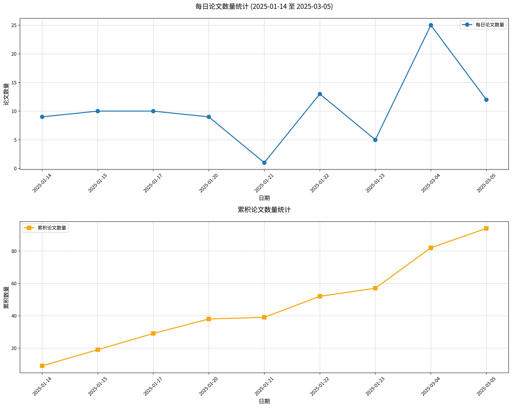

#  Hugging Face 2025-03-05 论文日报

## 📊 今日论文统计
- 总论文数：12
- 热门领域：LLM, NLP, GPT

## 📝 论文详情

### 1. MPO：基于元计划优化提升LLM智能体性能

**原文标题：** MPO: Boosting LLM Agents with Meta Plan Optimization

**摘要：**
近年来，大型语言模型（LLMs）的进展使得基于LLM的智能体能够成功应对交互式规划任务。然而，尽管取得了成功，现有方法常常面临规划幻觉问题，并且需要为每个新智能体重新训练。为了解决这些挑战，我们提出了元计划优化（MPO）框架，该框架通过直接整合显式指导来增强智能体的规划能力。与以往依赖复杂知识的方法不同，这些方法要么需要大量人力，要么缺乏质量保证，MPO通过元计划提供高层次的通用指导，以辅助智能体规划，并基于智能体任务执行的反馈实现元计划的持续优化。我们在两个代表性任务上进行的实验表明，MPO显著优于现有基线方法。此外，我们的分析表明，MPO提供了一种即插即用的解决方案，在先前未见过的场景中提升了任务完成效率和泛化能力。

**论文链接：** [HuggingFace](https://huggingface.co/papers/2503.02682) | [arXiv](https://arxiv.org/abs/2503.02682)

---

### 2. Mask-DPO：基于直接偏好优化的大语言模型细粒度事实性对齐方法

**原文标题：** Mask-DPO: Generalizable Fine-grained Factuality Alignment of LLMs

**摘要：**
大语言模型（LLMs）在作为AI助手服务于各个领域时，常常会出现幻觉（即不忠实或无意义的信息）。由于幻觉总是伴随着LLM响应中的真实内容，以往的事实性对齐方法在进行响应级别的偏好学习时，不可避免地会在训练过程中引入噪声。因此，本文提出了一种基于直接偏好优化（DPO）的细粒度事实性对齐方法，称为Mask-DPO。通过将句子级别的事实性作为掩码信号，Mask-DPO仅从优选样本中的事实正确的句子中学习，并防止对非优选样本中的事实内容进行惩罚，从而解决了偏好学习中的模糊性问题。大量的实验结果表明，尽管训练过程中未见过的领域内和领域外数据集中的问题及其相关主题，Mask-DPO仍能显著提高LLMs对这些问题的响应的事实性。仅在ANAH训练集上进行训练后，Llama3.1-8B-Instruct在ANAH测试集上的得分从49.19%提高到77.53%，甚至超过了Llama3.1-70B-Instruct的得分（53.44%），同时其在领域外的Biography数据集上的FactScore也从30.29%提高到39.39%。我们进一步研究了Mask-DPO在不同训练样本扩展策略下的泛化特性，发现扩展数据集中的主题数量比扩展问题数量更为有效。我们提出了一个关于LLMs事实对齐作用的假设，并进行了概念验证实验以验证这一假设。我们希望该方法及其发现为未来扩展事实性对齐的研究铺平道路。

**论文链接：** [HuggingFace](https://huggingface.co/papers/2503.02846) | [arXiv](https://arxiv.org/abs/2503.02846)

---

### 3. 大语言模型时代的维基百科：演变与风险

**原文标题：** Wikipedia in the Era of LLMs: Evolution and Risks

**摘要：**
本文对大语言模型（LLMs）对维基百科的影响进行了全面分析，通过现有数据考察了维基百科的演变，并利用模拟探讨了潜在风险。我们首先通过分析页面浏览量和文章内容来研究维基百科近期的变化，并评估LLMs的影响。随后，我们评估了LLMs如何影响与维基百科相关的各种自然语言处理（NLP）任务，包括机器翻译和检索增强生成（RAG）。我们的发现和模拟结果表明，维基百科文章已受到LLMs的影响，某些类别的影响约为1%-2%。如果基于维基百科的机器翻译基准受到LLMs的影响，模型的得分可能会被夸大，模型之间的比较结果也可能发生变化。此外，如果知识库被LLM生成的内容污染，RAG的有效性可能会降低。尽管LLMs尚未完全改变维基百科的语言和知识结构，但我们认为我们的实证研究结果提示需要仔细考虑未来潜在的风险。

**论文链接：** [HuggingFace](https://huggingface.co/papers/2503.02879) | [arXiv](https://arxiv.org/abs/2503.02879)

---

### 4. MultiAgentBench：评估LLM智能体的协作与竞争能力

**原文标题：** MultiAgentBench: Evaluating the Collaboration and Competition of LLM
  agents

**摘要：**
大型语言模型（LLMs）作为自主智能体展现了显著的能力，然而现有的基准测试要么专注于单智能体任务，要么局限于狭窄的领域，未能捕捉多智能体协调与竞争的动态。本文介绍了MultiAgentBench，一个全面的基准测试，旨在评估基于LLM的多智能体系统在多样化、互动场景中的表现。我们的框架不仅衡量任务完成情况，还使用基于里程碑的关键性能指标来评估协作与竞争的质量。此外，我们评估了各种协调协议（包括星型、链型、树型和图型拓扑）以及创新策略，如群体讨论和认知规划。值得注意的是，gpt-4o-mini在研究场景中达到了平均最高的任务得分，图结构在协调协议中表现最佳，认知规划将里程碑达成率提高了3%。代码和数据集可在https://github.com/MultiagentBench/MARBLE公开获取。

**论文链接：** [HuggingFace](https://huggingface.co/papers/2503.01935) | [arXiv](https://arxiv.org/abs/2503.01935)

---

### 5. FR-Spec：通过频率排序的推测采样加速大词汇量语言模型

**原文标题：** FR-Spec: Accelerating Large-Vocabulary Language Models via
  Frequency-Ranked Speculative Sampling

**摘要：**
推测采样已成为加速大型语言模型（LLMs）自回归生成过程的重要技术，通过利用草稿-验证机制在每次前向传递中生成多个令牌。虽然最先进的推测采样方法仅使用单层和语言建模（LM）头作为草稿模型以实现显著的层压缩，但对于大词汇量的LLMs（如词汇量为128k的Llama-3-8B），其效率提升大幅降低。为了解决这一问题，我们提出了FR-Spec，一种频率排序的推测采样框架，通过词汇空间压缩优化草稿候选选择。通过将草稿搜索限制在频率优先的令牌子集，我们的方法减少了75%的LM头计算开销，同时确保最终输出分布的等价性。在多个数据集上的实验表明，与最先进的推测采样方法EAGLE-2相比，平均加速1.12倍。

**论文链接：** [HuggingFace](https://huggingface.co/papers/2502.14856) | [arXiv](https://arxiv.org/abs/2502.14856)

---

### 6. SemViQA：面向越南语信息事实核查的语义问答系统

**原文标题：** SemViQA: A Semantic Question Answering System for Vietnamese Information
  Fact-Checking

**摘要：**
随着GPT和Gemini等大型语言模型（LLMs）的兴起，虚假信息的传播日益严重，这要求我们开发出强大的事实核查解决方案，尤其是针对越南语等低资源语言。现有方法在处理语义模糊、同音异义词和复杂语言结构时存在困难，常常在准确性和效率之间做出妥协。我们提出了SemViQA，这是一种新颖的越南语事实核查框架，集成了基于语义的证据检索（SER）和两步裁决分类（TVC）。我们的方法在精确性和速度之间取得了平衡，在ISE-DSC01数据集上达到了78.97%的严格准确率，在ViWikiFC数据集上达到了80.82%的准确率，并在UIT数据科学挑战赛中获得了第一名。此外，SemViQA Faster在保持竞争力的准确性的同时，将推理速度提高了7倍。SemViQA为越南语事实核查设立了新的基准，推动了对抗虚假信息的斗争。源代码可在以下网址获取：https://github.com/DAVID-NGUYEN-S16/SemViQA。

**论文链接：** [HuggingFace](https://huggingface.co/papers/2503.00955) | [arXiv](https://arxiv.org/abs/2503.00955)

---

### 7. PipeOffload：通过内存优化提升流水线并行的可扩展性

**原文标题：** PipeOffload: Improving Scalability of Pipeline Parallelism with Memory
  Optimization

**摘要：**
流水线并行（Pipeline Parallelism, PP）被广泛用于训练大型语言模型（LLMs），但其可扩展性往往受到高激活内存消耗的限制，因为随着PP程度的增加，飞行中的微批次数量也会增加。本文重点通过利用PP中尚未充分探索的内存卸载策略来解决这一挑战。通过实证研究，我们发现，在大多数标准配置中，至少一半甚至全部的激活都可以以可忽略的开销进行卸载。在无法完全卸载的情况下，我们引入了一种新颖的选择性卸载策略，该策略以优于线性的方式减少峰值激活内存。此外，我们将内存卸载与其他技术相结合，以综合考虑整体吞吐量和内存限制。我们的实验证明，每设备的激活内存随着阶段总数的增加而有效减少，使得PP成为比TP更强的替代方案，在内存消耗更低的情况下提供了高达19%的加速。该实现已在https://github.com/sail-sg/zero-bubble-pipeline-parallelism开源。

**论文链接：** [HuggingFace](https://huggingface.co/papers/2503.01328) | [arXiv](https://arxiv.org/abs/2503.01328)

---

### 8. ATLaS：通过关键步骤学习进行智能体调优

**原文标题：** ATLaS: Agent Tuning via Learning Critical Steps

**摘要：**
大型语言模型（LLM）智能体在多领域任务中展示了显著的泛化能力。现有的智能体调优方法通常在整个专家轨迹上进行监督微调。然而，完整轨迹的行为克隆可能会引入专家偏见，并削弱对专家数据未覆盖状态的泛化能力。此外，关键步骤，如规划、中间子任务的复杂推理和战略决策，对于智能体任务的成功至关重要，因此学习这些步骤是提升LLM智能体的关键。为了更有效和高效地进行智能体调优，我们提出了ATLaS，该方法识别专家轨迹中的关键步骤，并仅在这些步骤上以较低成本微调LLM。通过将训练重点集中在少数关键步骤上，我们的方法减轻了过拟合整个轨迹的风险，并促进了在不同环境和任务中的泛化。在广泛的实验中，仅通过ATLaS选择的30%关键步骤微调的LLM表现优于在所有步骤上微调的LLM和最近的开源LLM智能体。ATLaS在与多样化环境交互的通用智能体中保持并提升了基础LLM的技能。

**论文链接：** [HuggingFace](https://huggingface.co/papers/2503.02197) | [arXiv](https://arxiv.org/abs/2503.02197)

---

### 9. 语言模型能够通过状态价值估计自我提升以优化搜索

**原文标题：** Language Models can Self-Improve at State-Value Estimation for Better
  Search

**摘要：**
在多步推理任务中，收集任务完成奖励的真实数据或人类示范通常成本高昂且耗时，尤其是在网页任务等交互式领域。为了解决这一瓶颈，我们提出了自教导前瞻（self-taught lookahead），这是一种自监督方法，利用状态转移动态来训练一个能够有效指导语言模型控制搜索的价值模型。我们发现，通过自教导前瞻改进的中等规模（80亿参数）开放权重价值模型，能够与使用前沿大型语言模型（如gpt-4o）作为价值模型的性能相媲美。此外，我们发现，自教导前瞻在不依赖真实奖励的情况下，与之前基于大型语言模型的树搜索相比，性能提升了20%，同时成本降低了37倍。

**论文链接：** [HuggingFace](https://huggingface.co/papers/2503.02878) | [arXiv](https://arxiv.org/abs/2503.02878)

---

### 10. UFO：通过开放式语言接口实现细粒度视觉感知的统一方法

**原文标题：** UFO: A Unified Approach to Fine-grained Visual Perception via Open-ended
  Language Interface

**摘要：**
通用模型在语言和视觉-语言任务中取得了显著成功，展示了统一建模的潜力。然而，如何有效地将检测和分割等细粒度感知任务整合到这些模型中仍然是一个重大挑战。这主要是因为这些任务通常严重依赖于特定任务的设计和架构，这可能会使建模过程复杂化。为了解决这一挑战，我们提出了\ours，一个通过开放式语言接口统一细粒度视觉感知任务的框架。通过将所有感知目标转换为语言空间，\ours将对象级检测、像素级分割和图像级视觉-语言任务统一到一个单一模型中。此外，我们引入了一种新颖的嵌入检索方法，该方法仅依赖于语言接口来支持分割任务。我们的框架弥合了细粒度感知和视觉-语言任务之间的差距，显著简化了架构设计和训练策略，同时在性能上与具有复杂任务特定设计的方法相当或更优。在五个标准视觉感知数据集上进行多任务训练后，\ours在COCO实例分割上比之前的最先进通用模型高出12.3 mAP，在ADE20K语义分割上高出3.3 mIoU。此外，我们的方法能够无缝集成现有的多模态大语言模型（MLLMs），有效地将细粒度感知能力与其先进的语言能力结合，从而实现更具挑战性的任务，如推理分割。代码和模型将公开提供。

**论文链接：** [HuggingFace](https://huggingface.co/papers/2503.01342) | [arXiv](https://arxiv.org/abs/2503.01342)

---

### 11. AppAgentX：将GUI代理进化为熟练的智能手机用户

**原文标题：** AppAgentX: Evolving GUI Agents as Proficient Smartphone Users

**摘要：**
近年来，大型语言模型（LLMs）的进展催生了能够与图形用户界面（GUI）交互的智能LLM代理。这些代理展现出强大的推理能力和适应性，使其能够执行传统上需要预定义规则的复杂任务。然而，基于LLM的代理对逐步推理的依赖常常导致效率低下，尤其是在处理常规任务时。相比之下，传统的基于规则的系统在效率上表现出色，但缺乏适应新场景的智能和灵活性。为了解决这一挑战，我们提出了一种新颖的GUI代理进化框架，该框架在保持智能和灵活性的同时提高了操作效率。我们的方法引入了一种记忆机制，记录代理的任务执行历史。通过分析这一历史，代理识别出重复的动作序列，并进化出高级动作作为快捷方式，取代这些低级操作，从而提高效率。这使得代理能够专注于需要更复杂推理的任务，同时简化常规操作。在多个基准任务上的实验结果表明，我们的方法在效率和准确性上均显著优于现有方法。代码将开源以支持进一步研究。

**论文链接：** [HuggingFace](https://huggingface.co/papers/2503.02268) | [arXiv](https://arxiv.org/abs/2503.02268)

---

### 12. SPIDER：一个全面的多器官监督病理学数据集及基线模型

**原文标题：** SPIDER: A Comprehensive Multi-Organ Supervised Pathology Dataset and
  Baseline Models

**摘要：**
推动计算病理学中的人工智能发展需要大规模、高质量且多样化的数据集，然而现有的公共数据集通常在器官多样性、类别覆盖范围或注释质量方面存在局限。为了弥补这一差距，我们引入了SPIDER（监督病理学图像描述库），这是目前最大的公开可用的多器官类型（包括皮肤、结直肠和胸部）的切片级数据集，每个器官都有全面的类别覆盖。SPIDER提供了由病理学专家验证的高质量注释，并包含周围上下文切片，这些切片通过提供空间上下文增强了分类性能。
  除了数据集，我们还展示了使用Hibou-L基础模型作为特征提取器并结合基于注意力的分类头在SPIDER上训练的基线模型。这些模型在多个组织类别中实现了最先进的性能，并为未来的数字病理学研究提供了强有力的基准。除了切片分类，该模型还支持快速识别重要区域、定量组织指标，并为多模态方法奠定了基础。

**论文链接：** [HuggingFace](https://huggingface.co/papers/2503.02876) | [arXiv](https://arxiv.org/abs/2503.02876)

---

## 🔍 关键词云图

## 📈 近期论文趋势

## 🎙️ 语音播报
- [收听今日论文解读](../audio/2025-03-05_daily_papers.mp3)

## 📱 订阅渠道
- GitHub: [hf-daily-paper-newsletter-chinese](https://github.com/Hiwyl/hf-daily-paper-newsletter-chinese)